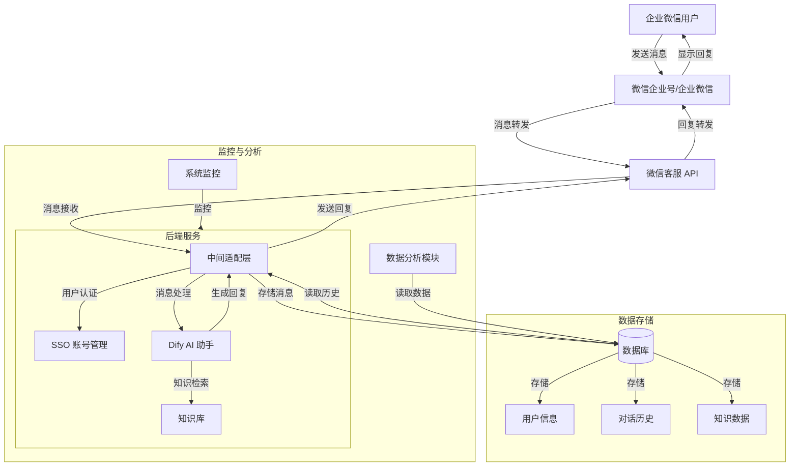

# 🚀 微信企业级智能客服后台服务项目设计方案


## 一、项目概述

随着企业数字化转型的加速，客户对于更智能、更高效的客服服务的需求日益增长。本项目旨在构建一个基于微信客服 API 和 Dify 的智能客服后台服务，为企业提供高效、智能的客服解决方案。通过对接微信企业号和 Dify，实现企业微信用户与智能客服之间的无缝交互，同时支持企业级的单点登录（SSO）和账号管理功能，提升企业的客户服务质量和客户满意度，降低客服成本。

## 二、项目目标

  1. **智能客服功能** ：基于 Dify 的 AI 能力，实现智能消息处理、任务分配、客户服务和任务列表管理。
  2. **企业微信集成** ：无缝对接微信企业号，支持企业微信用户通过聊天窗口与智能客服进行实时交互。
  3. **SSO 账号管理** ：实现企业级的单点登录功能，确保用户身份的安全性和一致性。
  4. **消息与知识管理** ：对用户消息和知识库进行有效管理，支持消息分类、存储和知识库的更新维护。
  5. **数据分析与监控** ：记录用户对话数据，进行数据分析和监控，为企业决策提供数据支持。

## 三、整体架构设计

以下是项目的整体架构图：



### 架构说明

  1. **微信企业号/企业微信** ：用户通过企业微信与企业进行交互，发起客服请求。
  2. **微信客服 API** ：接收用户的消息，并将用户消息传递给后端服务。
  3. **Dify AI 助手** ：提供智能回复生成服务。
  4. **中间适配层** ：对接微信客服 API 和 Dify，处理消息的转换和转发，支持 SSO 账号管理。
  5. **数据库** ：存储用户信息、对话历史和知识库数据。

## 四、技术选型

### 后端技术

| 技术名称        | 作用                                   |
|-----------------|----------------------------------------|
| **Python**      | 主要后端服务开发，处理消息和请求。      |
| **Golang**      | 高性能服务和并发处理模块的实现。        |
| **FastAPI**     | 构建高性能的 RESTful API。              |
| **RabbitMQ**    | 消息队列，实现异步消息处理。            |

### 前端技术

| 技术名称    | 作用                     |
|-------------|---------------------------|
| **React.js**| 构建现代化的前端界面。     |
| **Ant Design**| 提供丰富的 UI 组件库。   |
| **Axios**   | 处理前端与后端的网络请求。 |

### 数据库

| 技术名称   | 作用                                       |
|------------|--------------------------------------------|
| **MySQL**  | 存储结构化数据，如用户信息和对话历史。     |
| **MongoDB**| 存储非结构化数据，如用户消息和知识库数据。 |
| **Redis**  | 用作缓存，提高数据访问速度和系统性能。     |

### 其他技术

  1. **微信客服 API** ：用于接收和发送企业微信消息。
  2. **Dify** ：提供智能回复生成服务，支持多种消息类型。
  3. **OAuth2** ：实现企业级的单点登录功能。

## 五、模块设计

### 1. 微信企业号对接模块

  * **功能描述** ：实现企业微信用户与智能客服的通信，接收用户消息并发送回复。
  * **对接流程** ：
    * 在微信企业号后台配置回调 URL，指定消息接收地址。
    * 使用企业微信提供的 API 进行消息加密与解密，确保消息的安全性。
    * 解析用户消息，提取消息类型、内容和用户信息。

  * **代码示例（Python）** ：
    ```python
    from wechatpy.enterprise.crypto import WeChatCrypto
    from wechatpy.exceptions import InvalidSignatureError

    crypto = WeChatCrypto(token, encoding_aes_key, corp_id)

    def decrypt_msg(encrypted_msg):
        try:
            return crypto.decrypt_message(encrypted_msg)
        except InvalidSignatureError:
            # 处理异常
            return None
    ```

### 2. Dify API 对接模块

  * **功能描述** ：将用户消息发送到 Dify，获取智能回复并返回给用户。
  * **对接流程** ：
    * 获取 Dify 的 API 密钥和 API 地址。
    * 将用户消息转换为 Dify 支持的格式，包含用户 ID、消息内容等。
    * 调用 Dify 的 API 接口，获取智能回复。
    * 将回复转换为微信支持的格式，通过微信客服 API 发送给用户。

  * **代码示例（Python）** ：
    ```python
    import requests

    def call_dify_api(user_id, message):
        headers = {
            'Authorization': f'Bearer {DIFY_API_KEY}',
            'Content-Type': 'application/json'
        }
        data = {
            'user_id': user_id,
            'message': message
        }
        response = requests.post(DIFY_API_URL, headers=headers, json=data)
        return response.json()['reply']
    ```

### 3. SSO 账号管理模块

  * **功能描述** ：实现企业级的单点登录功能，确保用户身份的安全性和一致性。
  * **实现原理** ：
    * 使用 OAuth2 或 OpenID Connect 协议，通过企业微信的身份验证服务进行用户身份验证。
    * 生成会话令牌，用于用户在系统中的身份标识。
    * 在用户登录后，自动将用户信息同步到系统数据库中。

### 4. 消息队列与异步处理模块

  * **功能描述** ：通过消息队列实现异步消息处理，提高系统的可扩展性和性能。
  * **技术选型** ：RabbitMQ 或 Kafka。
  * **实现流程** ：
    * 消息接收后，将其放入消息队列中。
    * 背景任务从队列中取出消息，并进行处理。
    * 处理完成后，将结果返回给用户。

### 5. 知识管理模块

  * **功能描述** ：管理企业知识库，为 Dify 提供准确的知识检索服务。
  * **实现功能** ：
    * 知识库的添加、编辑和删除。
    * 知识库数据的导入和导出。
    * 知识库的分类和标签管理。

### 6. 数据分析与监控模块

  * **功能描述** ：记录用户对话数据，进行数据分析和监控。
  * **实现功能** ：
    * 记录用户消息和对话历史，存储在数据库中。
    * 对用户行为进行分析，生成数据报告。
    * 对系统性能进行监控，及时发现和解决问题。

## 六、安全性设计

  1. **HTTPS** ：确保所有通信都使用 HTTPS，防止数据在传输过程中被窃取。
  2. **消息加密** ：微信的消息使用 AES 加密，在后端进行解密处理。
  3. **API 密钥管理** ：使用环境变量或密钥管理服务（如 Vault）存储敏感信息，避免硬编码。

## 七、部署与测试

  1. **部署环境** ：
    * **操作系统** ：Linux（推荐使用 Ubuntu 或 CentOS）。
    * **服务器** ：云服务器（如 AWS、阿里云或腾讯云）。
    * **Web 服务器** ：Nginx 或 Apache。

  2. **部署流程** ：
    * 配置 Nginx 或反向代理服务器，将请求转发到后端服务。
    * 使用 Docker 或 Kubernetes 进行容器化部署，提高系统的可移植性和可扩展性。

  3. **测试方法** ：
    * 单元测试：对每个模块进行单元测试，确保其功能正常。
    * 集成测试：测试模块之间的交互和集成，确保系统的稳定性和一致性。
    * 性能测试：测试系统的性能，确保其能够处理高并发请求。

## 八、扩展功能规划

  1. **多语言支持** ：通过集成语言翻译 API，实现多语言的客服支持。
  2. **数据分析与挖掘** ：对用户数据进行深度分析，挖掘用户需求和行为模式。
  3. **插件扩展** ：支持第三方插件，如天气查询、支付等，丰富客户服务功能。

## 九、项目时间线

以下是项目的初步时间线：

| 阶段               | 时间周期     | 完成内容                                   |
|--------------------|--------------|--------------------------------------------|
| 需求分析与设计     | 第 1 - 2 周  | 完成项目需求分析和设计方案的制定。         |
| 核心功能开发       | 第 3 - 8 周  | 完成微信企业号对接、Dify 接入和 SSO 实现。 |
| 扩展功能开发       | 第 9 - 12 周 | 实现消息队列、知识管理等功能。             |
| 测试与优化         | 第 13 - 14 周| 进行系统测试和性能优化。                   |
| 上线与维护         | 第 15 周及以后| 项目上线，持续维护和更新。                 |

## 十、项目团队

项目团队将由以下成员组成：

  * **项目经理** ：负责项目的整体规划、协调和管理。
  * **后端开发工程师** ：负责后端服务的开发和维护。
  * **前端开发工程师** ：负责前端界面的开发和优化。
  * **测试工程师** ：负责项目的测试和质量保证。
  * **运维工程师** ：负责项目的部署和运维工作。

## 十一、项目风险与挑战

  1. **技术风险** ：微信企业号的 API 更新可能导致对接失败，需要及时跟进和更新代码。
  2. **数据安全风险** ：用户数据的存储和传输需要严格的安全措施，避免数据泄漏。
  3. **性能瓶颈** ：高并发情况下，系统可能面临性能瓶颈，需要进行优化和扩展。

## 十二、项目预算

以下是一个简要的项目预算：

| 项目名称          | 预算（元） |
|-------------------|------------|
| 服务器租赁        | 2000       |
| 数据库服务        | 1500       |
| 开发工具与软件    | 1000       |
| 开发人员工资      | 60000      |
| 测试与部署费用    | 5000       |
| **总预算**        | **69500**  |

## 十三、项目成果与价值

  1. **提升客户满意度** ：通过智能客服提供准确、及时的回复，提高客户满意度和忠诚度。
  2. **降低客服成本** ：减少人工客服的工作量，降低企业的客服成本。
  3. **提高企业形象** ：展示企业对客户体验的重视，提升企业的品牌形象和竞争力。

通过本项目的实施，我们希望能够为企业提供一个稳定、高效、智能的客服解决方案，助力企业在数字化时代取得更大的成功。