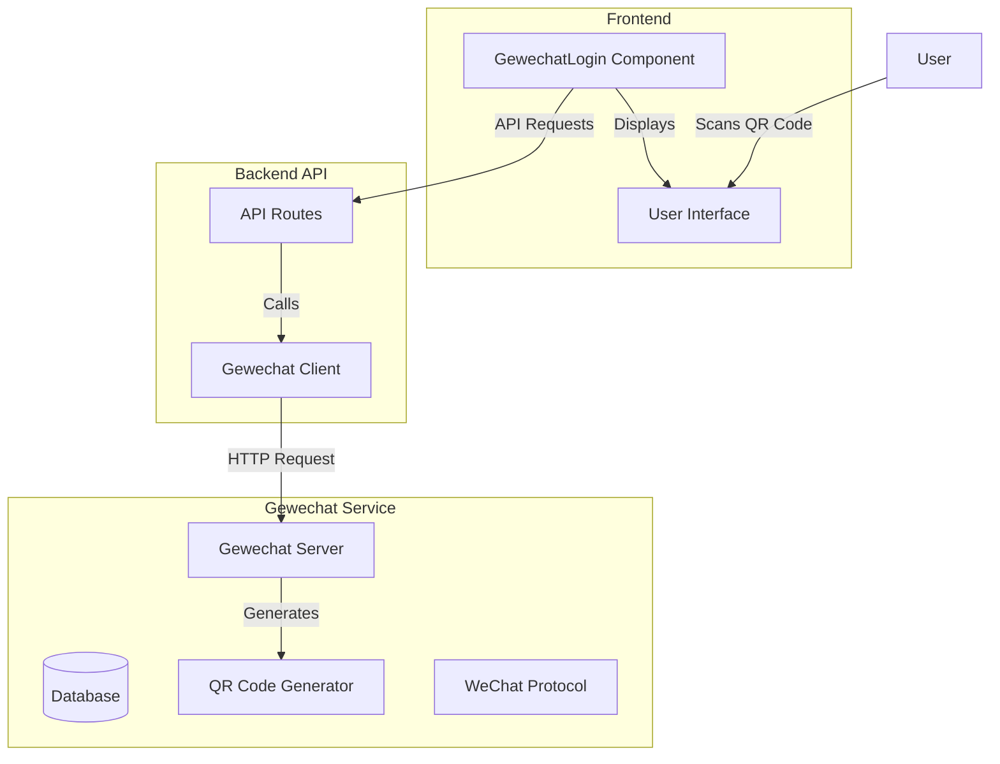

# Gewechat 微信个人号集成指南

## 概述

Gewechat是一个基于ipad协议的微信个人号接入服务，相比itchat更加稳定。本项目集成了Gewechat服务，提供了完整的Web端扫码登录体验，可用于将微信个人号连接到智能客服系统。通过此集成，您可以：

1. 通过Web端直接扫码登录微信个人号
2. 自动保存登录配置信息用于后续消息收发
3. 无需编写复杂代码即可实现微信个人号与系统的对接

## 系统架构

系统架构图请参见 [Gewechat架构图](./architecture.md)



本系统的架构由以下几部分组成：

1. **Frontend**：前端Vue组件，提供扫码登录界面
2. **Backend API**：FastAPI后端接口，处理登录请求和状态查询
3. **Gewechat Service**：容器化的Gewechat服务，负责生成登录二维码和处理微信通信
4. **Config Storage**：配置存储，保存登录后的凭证信息

## 前端组件

`GewechatLogin.vue`是一个封装完善的Vue组件，提供以下功能：

- 获取登录二维码
- 实时监控登录状态
- 展示登录结果和账号信息
- 处理登录成功后的配置保存

### 使用方法

1. 在Vue组件中引入：

```javascript
import GewechatLogin from './components/GewechatLogin.vue'

export default {
  components: {
    GewechatLogin
  }
}
```

2. 在模板中使用：

```html
<GewechatLogin @login-success="handleLoginSuccess" />
```

3. 处理登录成功事件：

```javascript
methods: {
  handleLoginSuccess(config) {
    console.log('登录成功，配置信息：', config)
    // 执行后续操作
  }
}
```

## 后端API

系统提供了以下API端点：

### 1. 获取登录二维码

```
GET /api/gewechat/login/qrcode
```

**返回示例**：
```json
{
  "success": true,
  "qrcodeUrl": "data:image/png;base64,iVBOR...",
  "token": "abc123def456"
}
```

### 2. 查询登录状态

```
GET /api/gewechat/login/status?token={token}
```

**参数**：
- `token`: 获取二维码时返回的token

**返回示例**：
```json
{
  "success": true,
  "status": 2,  // 0-未扫码，1-已扫码等待确认，2-已登录，3-二维码过期
  "accountInfo": {
    "wxid": "wxid_abcdefg",
    "nickname": "用户昵称",
    "avatar": "头像URL"
  },
  "config": {
    // 微信登录配置信息
  }
}
```

### 3. 保存配置信息

```
POST /api/gewechat/config/save
```

**请求体**：
```json
{
  // 微信登录配置信息
}
```

**返回示例**：
```json
{
  "success": true,
  "message": "Configuration saved successfully",
  "config_path": "/path/to/config/file"
}
```

### 4. 发送消息

```
POST /api/gewechat/message/send
```

**请求体**：
```json
{
  "to_user": "wxid_abcdefg",
  "type": "text",
  "content": "你好，这是一条测试消息"
}
```

**返回示例**：
```json
{
  "success": true,
  "messageId": "msg123456"
}
```

## 配置存储

登录成功后，系统会自动保存配置信息到以下位置：

1. 带时间戳的配置文件：`config/gewechat_config_{timestamp}.json`
2. 最新配置文件：`config/gewechat_config_latest.json`

配置文件包含访问微信API所需的所有凭证和信息，可用于后续的消息收发操作。

## 使用流程

1. **部署Gewechat服务**：
   ```bash
   # 启动Gewechat服务容器
   docker-compose up -d gewechat
   ```

2. **访问Web界面**：打开浏览器访问应用前端

3. **扫码登录**：
   - 点击"获取登录二维码"按钮
   - 使用微信扫描显示的二维码
   - 在微信中确认登录

4. **配置保存**：登录成功后，系统会自动保存配置信息

5. **消息收发**：
   - 使用API发送消息
   - 接收来自微信的消息并处理

## 故障排除

1. **无法获取二维码**：
   - 检查Gewechat服务是否正常运行（`docker ps | grep gewechat`）
   - 确认API地址配置正确（默认为`http://gewechat:2531`）
   - 检查网络连接是否正常

2. **扫码后没有响应**：
   - 检查状态轮询是否正常工作
   - 可能需要重新获取二维码

3. **登录成功但无法发送消息**：
   - 确认配置信息已正确保存
   - 检查微信账号状态是否正常
   - 查看日志文件：`gewechat/data/log/gewe.log`

## 注意事项

1. Gewechat基于ipad协议，比itchat更稳定但仍有一定风险，请谨慎使用
2. 此项目仅用于个人娱乐场景，请勿用于任何商业场景
3. 微信登录状态可能会因为各种原因失效，建议实现定时检查机制

## API 参考

详细的API参考文档请查看 [API 文档](./API.md)
